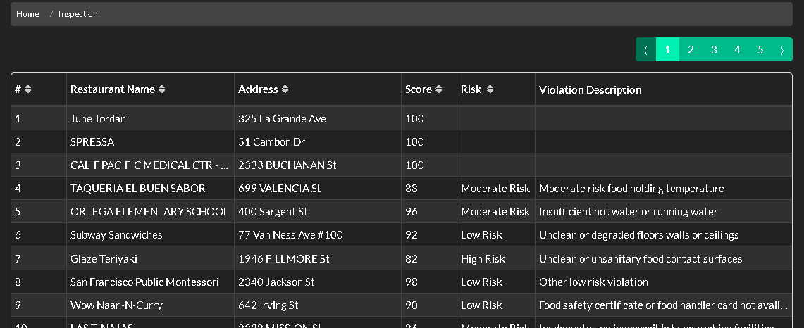
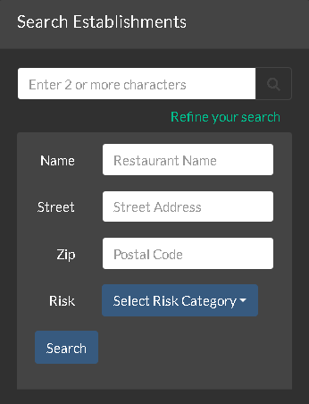
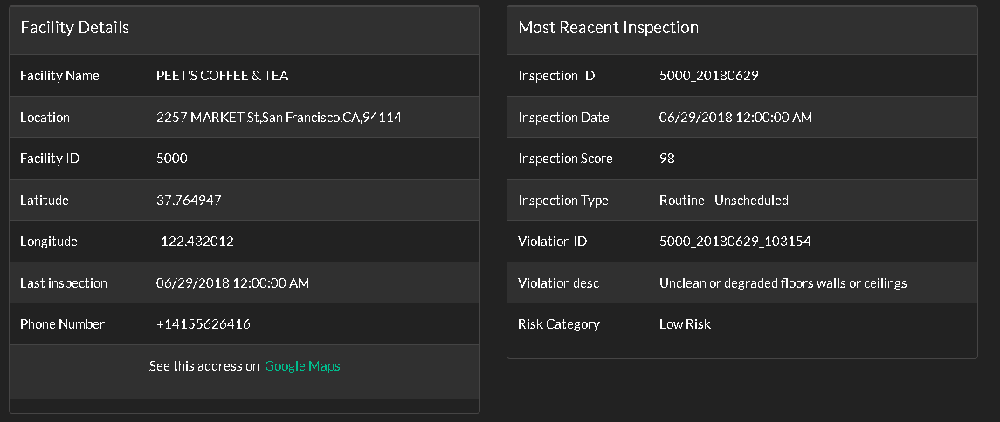
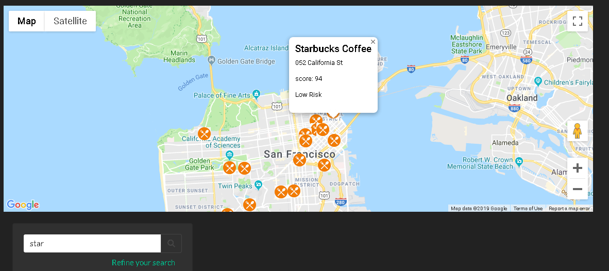
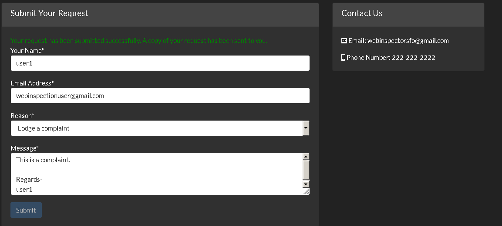
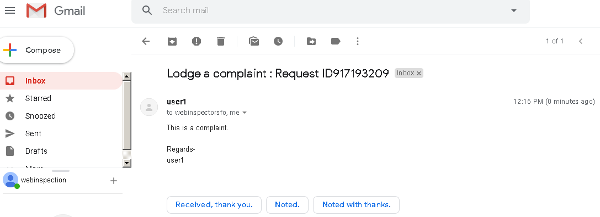
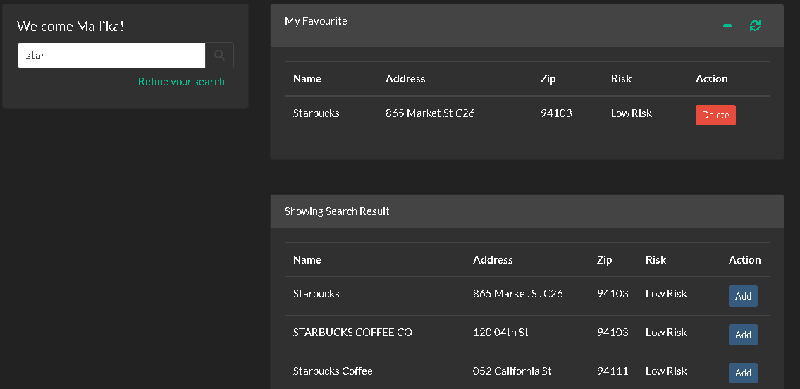

# Project 3: Restaurant Inspection

[Restaurant Inspection presentation link](https://1drv.ms/p/s!ArBfFmjRebnagyy2moVstppEpdDf)

[Restaurant Inspection application link](https://ancient-coast-39307.herokuapp.com/)

## Description
This application was written for project 3 of the UCD Coding Bootcamp. The front end was built using React, React Bootstrap and CSS/CSS Bootstrap. The backend uses Sequelize and Mysql database.

Restaurant Inspection website provides a 360 degree view of the restaurents in your favourite city San francisco. I have used San Francisco Health Department inspection report and scoring system which is publically available and integrated into my interactive website.You can get the violation report and risk category of your favourite restaurants from this website.Also users can serach the location on map and get the direction from google map. Website allows users to logde complain and request recent/historical inspection data.You can list and save your favourite restaurants after registration and login. 

## Technology
* React
* Mysql2
* Sequelize
* Express
* Node
* AJAX
* API - Restaurants Inspection Data from   
* CSS
* CSS Bootstrap
* Dotenv
* Font Awesome
* HTML
* JavaScript
* jQuery
* Moment.js
* bcrypt and Jason webtoken

## Authors and acknowledgment
* Mallika Chakraborty

## Sample Views

***
### Inspection Data Table with column Sort 

***
### Search & Refine Search 

***
### Inspection Report based on Search 

***
### Search based Google Map 

***
### Contact Form and Send Email

***
### User page with Add & Delete My Favourite

